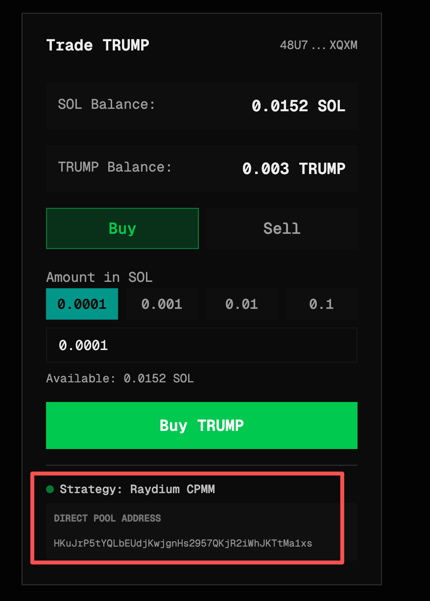

## Description
- Implemented features based on the requirements in `docs/requirements.md`.

- Currently, only Raydium CPMM Pools containing wSOL tokens are matched.
- Some UX details have not been considered.
- Transaction performance optimization has not been considered, e.g. checking ATA account every time; caching getAccountInfo, getPoolState results.
- I used my own acccount because insufficient funds in the test account.

## Successful transactions
- https://solscan.io/tx/aZ9rjgVQAoijvdZPVA58bqt4Z7grBH6mGmnMqa5721DP6zmD4q28gg2zFRAtUnUC7eWeojxD4hy7xxCWgaWhMZ1
- https://solscan.io/tx/5TinyZ6M1MgV7twpiVTpeufgLhFtvMCvUoFwM6LUdvPkg1rPuLts88QP1CLFNyGQiKTtBX9Ygc3fvFfttvBmPVDx

## Implementation Log
1. Lacking Solana development experience but having some EVM experience, I first learned the concepts to understand the requirements.
    - Jupiter: Similar to the 1inch aggregator in EVM.
    - Raydium: Similar to Uniswap AMM in EVM.
    - CPMM: Similar to the Uniswap V2 protocol in EVM.
    - Requirement: Current transactions use aggregator APIs; need to switch to direct interaction with specified contracts to improve performance.
2. With clear requirements and a manageable scope, I proceeded directly with AI vibe coding.
3. Due to my lack of Solana experience and errors from the AI (Gemini 3 Pro), debugging took a considerable amount of time.
4. After successful implementation, I studied Solana-related knowledge and optimized the code structure:
    - ATA (Associated Token Account) concept.
    - Implementation of multi-calls.
    - Encoding and decoding of addresses and PublicKeys.
    - SPL Token standard and Token Program ID.
    - SOL <-> wSOL conversion.
    - Using `@codex-data/sdk` for data queries.
    - Using `@solana/web3.js` for transaction construction.
    - How to swap by using Raydium CPMM pool.

## Getting Started

First, run the development server:

```bash
npm install
npm run dev
```

Open [http://localhost:3000](http://localhost:3000) with your browser to see the result.
